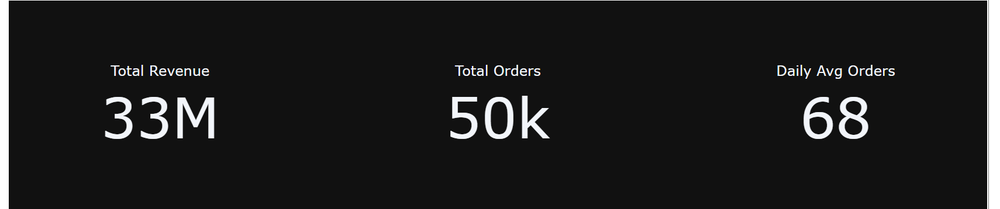

# 📊 Amazon Sales Analysis: Business Insights & Data Strategy

هذا المشروع مش مجرد تحليل بيانات عادي، هو محاكاة لقرار بزنس حقيقي مبني على أرقام ضخمة (أكثر من **13 ألف طلب**) بإجمالي مبيعات **8.4 مليون دولار**. الهدف كان إيجاد الفرص الضايعة وازاي نقدر نكبر الأرقام دي باستخدام **Python**.

---

## 📂 1. Data Overview (إيه المشروع؟)
استخدمت مكتبات البايثون (Pandas, Plotly, Seaborn) عشان أحلل داتا شاملة لمبيعات أمازون العالمية. التحليل ركز على:
* **توزيع المبيعات جغرافيًا** لمعرفة أقوى الأسواق.
* **سلوك الدفع** عند الزبائن.
* **تأثير الخصومات** على المكسب الصافي.

---

## ⚠️ 2. Challenges & Solutions (المشاكل اللي واجهتني وحلها)

### **المشكلة الأولى: لغز الخصومات (The Discount Trap)** 📉
* **المشكلة:** لاحظت في الرسم البياني إن كل ما بنزود الخصم عن **5%**، متوسط الإيراد لكل طلب بينزل بشكل كبير. ده معناه إننا بنخسر فلوس عشان نجيب زبائن.
* **الحل:** اقترحت إننا نثبت سقف للخصومات عند **5% لـ 10%** كحد أقصى، ونستبدل الخصومات الكبيرة بعروض "شحن مجاني" أو "نقاط ولاء".

### **المشكلة الثانية: النمو البطئ (Steady but Slow Growth)** 📈
* **المشكلة:** الأرقام بينت إن النمو من 2022 لـ 2023 كان مستقر بس بطيء.
* **الحل:** بما إن "المحافظ الإلكترونية" (Wallets) هي الوسيلة المفضلة، فالحل هو تكثيف العروض لمستخدمي هذه الوسيلة لزيادة سرعة المبيعات.

---

## 🚀 3. Final Business Recommendations (الخلاصة)
1. **الاستثمار في الشرق الأوسط:** بما أنها المنطقة الأعلى مبيعاً بـ **2.13M$**، لازم ميزانية الإعلانات تتوجه هناك فوراً.
2. **عروض الـ Cross-selling:** مبيعات الأقسام (ملابس، إلكترونيات، تجميل) متوازنة جداً، وده بيسمح لنا نعرض منتجات تجميل للي بيشتري ملابس ونزود سلة المشتريات.

---

## 🖼️ 4. Visual Gallery (معرض التحليلات)

### توزيع المبيعات حسب المنطقة

### أفضل طرق الدفع استخداماً

### تحليل الإيرادات حسب الفئة

### إحصائيات عامة

---
*تم إعداد هذا التحليل بواسطة محمد محمود - محلل بيانات.*
